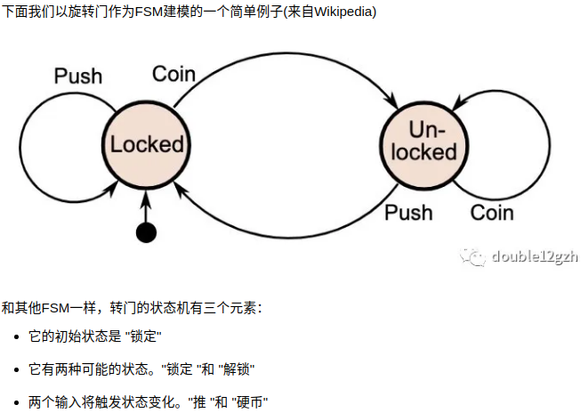
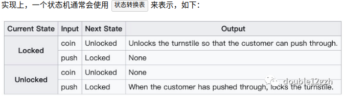
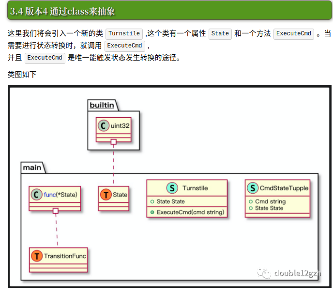

# 什么是状态机
有限状态机(FSM)或简称状态机，是一种计算的数学模型。它是一个抽象的机器，在任何时间都可以处于有限的状态之一。FSM可以根据一些输入从一个状态变为另一个状态；从一个状态到另一个状态的变化称为转换。

-   有限状态机有两个必要的特点，一是离散的，二是有限的。基于这两点，现实世界上绝大多数事物因为复杂的状态而无法用有限状态机表示。

而描述事物的有限状态机模型的元素由以下组成：
-   状态（State）：事物的状态，包括初始状态和所有事件触发后的状态。
-   事件（Event）：触发状态变化或者保持原状态的事件。
-   行为或转换（Action/Transition）：执行状态转换的过程。
-   检测器（Guard）：检测某种状态要转换成另一种状态的条件是否满足。

一个FSM由三个关键要素组成：**初始状态** 、**所有可能状态的列表**、**触发状态转换的输入**。

    v1，以直接的形式实现FSM。
    v2，做一些重构以减少代码重复。
    v3、引入状态转换表
    v4，用OOP重构

## v3

## v4

